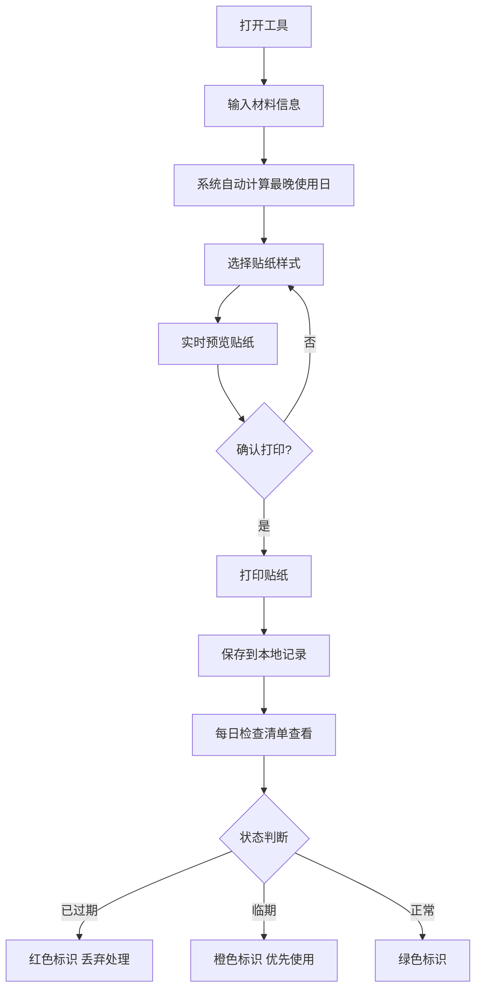

## 1. 产品概述
纯前端离线效期贴纸生成工具，面向小型牙科诊所和个人牙医，无需登录即可使用。用户输入牙科材料信息，系统即时计算最晚使用日，生成可打印贴纸，并提供每日到期检查清单功能。
- 解决痛点：小诊所缺乏库存管理系统，材料过期风险高，人工记录易出错
- 市场价值：低成本、零门槛的材料效期管理方案，直接打印贴纸贴在瓶身上即可使用

## 2. 核心功能

### 2.1 用户角色
无需注册登录，所有用户匿名使用，数据保存在本地浏览器中。

### 2.2 功能模块
1. **贴纸生成页**：材料信息输入表单、日期自动计算、三种贴纸样式实时预览、打印设置
2. **今日检查清单页**：按到期时间排序的材料列表、临期/过期状态标识、快速筛选
3. **历史记录管理**：本地存储的贴纸记录、编辑/删除功能

### 2.3 页面详情
| 页面名称 | 模块名称 | 功能描述 |
|---------|---------|---------|
| 贴纸生成页 | 信息输入表单 | 材料名称、批号、开封日期、有效期、开封后可用天数、存放柜号、临期提醒天数 |
| 贴纸生成页 | 日期自动计算 | 自动计算"最晚使用日"（开封+可用天数 与 有效期 取较早者） |
| 贴纸生成页 | 贴纸样式选择 | 极简版、护士提醒版、儿童牙科彩色版三种样式切换 |
| 贴纸生成页 | 实时预览 | 贴纸内容和样式即时更新预览 |
| 贴纸生成页 | 打印功能 | 一页多张标签排版，支持浏览器打印 |
| 今日检查清单 | 到期排序列表 | 按最晚使用日从近到远排列所有记录 |
| 今日检查清单 | 状态标识 | 已过期（红色）、临期（橙色）、正常（绿色）三种状态 |
| 今日检查清单 | 记录管理 | 编辑、删除、批量操作 |
| 历史记录管理 | 数据持久化 | localStorage本地存储，刷新页面不丢失 |

## 3. 核心流程
用户打开工具 → 输入材料信息 → 系统实时计算最晚使用日 → 选择贴纸样式 → 预览确认 → 打印贴纸 → 保存记录 → 每日打开检查清单查看临期材料

## 4. 用户界面设计

### 4.1 设计风格
- **主色调**：医疗蓝 (#1E88E5) 作为主色，白色为底，符合医疗行业专业感
- **辅助色**：成功绿 (#4CAF50)、警告橙 (#FF9800)、危险红 (#F44336) 用于状态标识
- **儿童版额外色**：粉色 (#FF9EB5)、天蓝 (#81D4FA)、柠黄 (#FFF176)
- **按钮样式**：圆角8px，扁平化设计，hover时轻微上浮阴影
- **字体**：中文使用 "PingFang SC"、"Microsoft YaHei"，数字使用等宽字体增强可读性
- **布局**：卡片式双栏布局（左侧表单+右侧预览），顶部导航切换页面
- **图标风格**：简洁线性图标，emoji增强亲和力（如🪥🦷💊🧴）

### 4.2 页面设计概述
| 页面名称 | 模块名称 | UI元素 |
|---------|---------|--------|
| 贴纸生成页 | 输入表单 | 分组卡片、日期选择器、数字步进器、下拉选择 |
| 贴纸生成页 | 预览区 | 贴纸卡片居中展示、阴影效果、三种样式切换标签 |
| 贴纸生成页 | 打印按钮 | 醒目CTA按钮、打印机图标 |
| 今日检查清单 | 状态筛选标签 | 全部/正常/临期/过期 筛选 |
| 今日检查清单 | 记录卡片 | 材料名、到期日、状态色条、柜号标签 |
| 今日检查清单 | 空状态 | 友好提示+快速添加按钮 |

### 4.3 响应式
- 桌面端优先设计（≥1024px）：左右双栏布局
- 平板端（768-1024px）：上下堆叠布局
- 移动端（<768px）：单列布局，表单字段折叠优化
- 打印模式：专用 @media print 样式，隐藏导航和表单，仅输出贴纸网格

### 4.4 贴纸样式详情
**极简版**：白底黑字，细边框，信息排版紧凑，适合专业诊所使用
**护士提醒版**：顶部醒目色条，大字体突出到期日，底部有"检查人签字"区域
**儿童牙科彩色版**：圆角造型，卡通边框（牙齿/星星图案），彩色渐变背景，表情emoji状态
