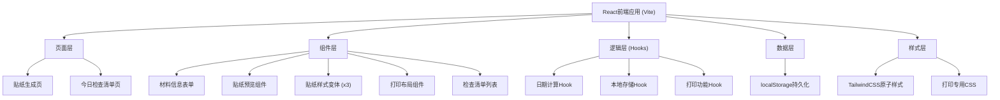
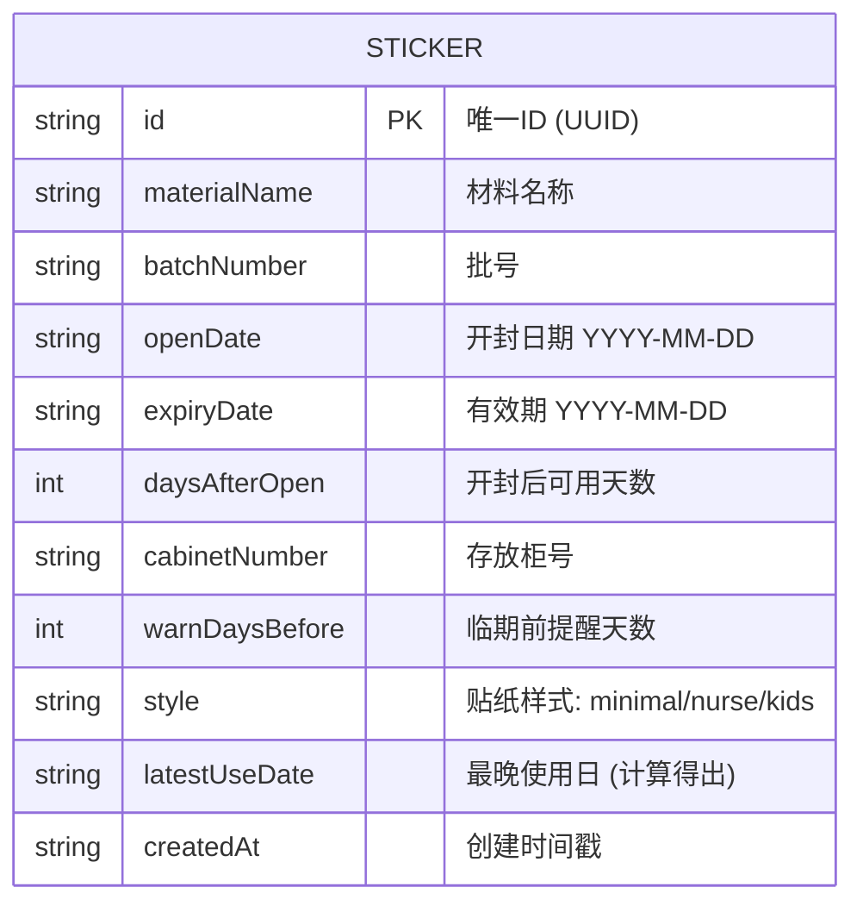

## 1. 架构设计



## 2. 技术描述
- **前端框架**：React@18 + TypeScript
- **构建工具**：Vite@5
- **样式方案**：TailwindCSS@3 + CSS变量
- **图标方案**：Lucide React（轻量线性图标库）
- **状态管理**：React Hooks (useState, useEffect, useMemo, useCallback) + Context
- **数据持久化**：浏览器 localStorage（纯前端离线，无需后端）
- **打印方案**：原生 window.print() + @media print CSS

## 3. 路由定义
| Route | 用途 |
|-------|------|
| / | 贴纸生成页（默认首页） |
| /checklist | 今日检查清单页 |

## 4. 数据模型

### 4.1 数据模型定义



### 4.2 TypeScript 类型定义
```typescript
type StickerStyle = 'minimal' | 'nurse' | 'kids';

interface StickerRecord {
  id: string;
  materialName: string;
  batchNumber: string;
  openDate: string;
  expiryDate: string;
  daysAfterOpen: number;
  cabinetNumber: string;
  warnDaysBefore: number;
  style: StickerStyle;
  latestUseDate: string;
  createdAt: string;
}

type ExpiryStatus = 'expired' | 'warning' | 'normal';
```

## 5. 核心算法说明

### 5.1 最晚使用日计算
```
最晚使用日 = MIN(开封日期 + 开封后可用天数, 有效期)
```

### 5.2 到期状态判断
```
剩余天数 = 最晚使用日 - 今日
剩余天数 < 0 → 已过期 (expired)
0 ≤ 剩余天数 ≤ warnDaysBefore → 临期 (warning)
剩余天数 > warnDaysBefore → 正常 (normal)
```

## 6. 项目目录结构
```
src/
├── components/
│   ├── StickerForm.tsx        # 材料信息输入表单
│   ├── StickerPreview.tsx     # 贴纸预览容器
│   ├── styles/
│   │   ├── MinimalSticker.tsx # 极简版贴纸
│   │   ├── NurseSticker.tsx   # 护士提醒版贴纸
│   │   └── KidsSticker.tsx    # 儿童彩色版贴纸
│   ├── PrintLayout.tsx        # 打印多张贴纸布局
│   ├── ChecklistItem.tsx      # 检查清单项
│   └── Navbar.tsx             # 导航栏
├── hooks/
│   ├── useDateCalculator.ts   # 日期计算逻辑
│   └── useLocalStorage.ts     # 本地存储Hook
├── pages/
│   ├── GeneratorPage.tsx      # 贴纸生成页
│   └── ChecklistPage.tsx      # 检查清单页
├── types/
│   └── index.ts               # 类型定义
├── utils/
│   └── dateUtils.ts           # 日期工具函数
├── App.tsx
├── main.tsx
└── index.css
```
